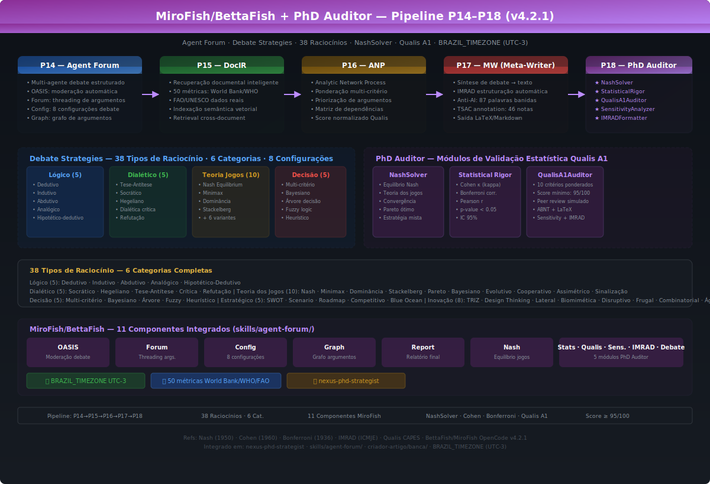
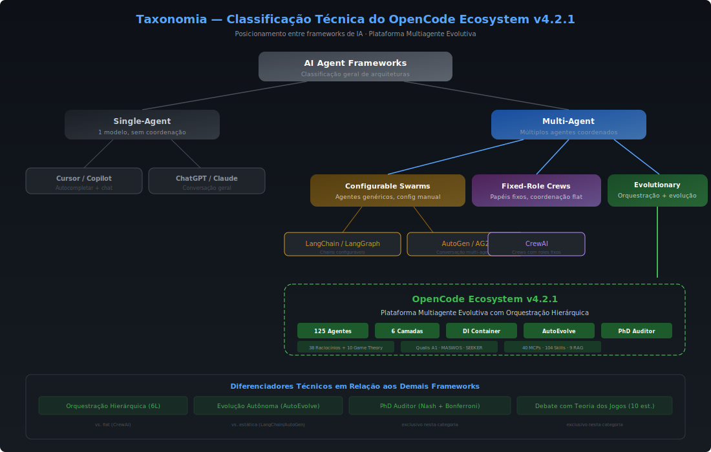
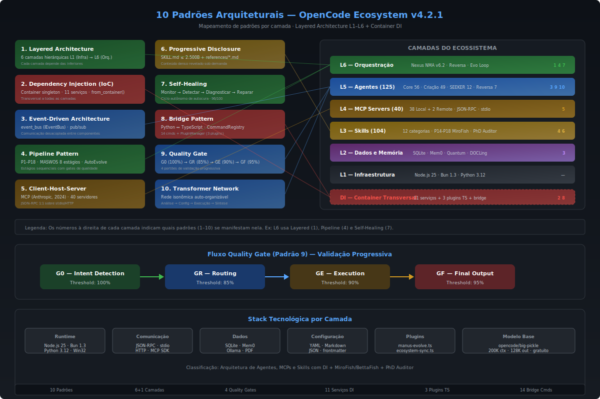
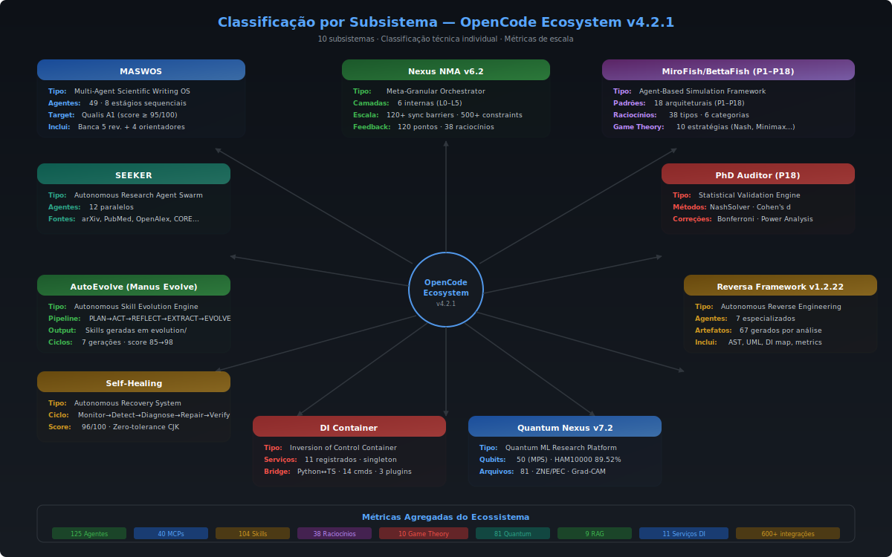

# OpenCode Ecosystem v4.2.3

O **OpenCode Ecosystem** é uma arquitetura multiagente evolutiva integrada ao OpenCode (OpenAI Codex CLI), composta por **125 agentes**, **41 servidores MCP**, **106 skills especializadas** (13 categorias), **11 serviços em Container DI**, **10 Ecosystem Hooks** (8 domínios de dados) e aproximadamente **120.000 linhas de código Python**. O ecossistema operacionaliza produção acadêmica Qualis A1, pesquisa científica autônoma, simulação MiroFish/BettaFish com 38 raciocínios + Teoria dos Jogos, computação quântica (81 arqs, 89.52% acc), engenharia reversa de sistemas legados, e **acesso universal a dados via DataOrchestrator** — tudo orquestrado por um Container central de Injeção de Dependência.

> **NOVO v4.2.3**: PyPI Scout (catálogo curado 22+ bibliotecas, matriz de afinidade 5 pipelines), DataOrchestrator (query em linguagem natural → 8 domínios), 10 Ecosystem Hooks (Geo, Finance, Crypto, BioMed, Academic, Economic, Health, PDF), 30+ bibliotecas instaladas, 20+ fontes Qualis A1.

> Repositório: `C:\Users\marce\.config\opencode` · Modelo: `opencode/big-pickle` (200K ctx, 128K out)

---

## Diagramas Técnicos — 10 SVGs (v4.2.1)

O ecossistema documenta sua arquitetura por meio de **10 diagramas SVG** em `diagrams/`, gerados e mantidos pelo Reversa Framework v1.2.22. SVGs são preferidos sobre PNG/Mermaid por oferecerem escalabilidade vetorial infinita, gradientes, glassmorphism e atualização programática via texto puro.

| # | Arquivo | Propósito | Processos-chave |
|---|---------|-----------|------------------|
| 1 | `architecture-overview.svg` | Mapa mestre 6 camadas | L1-Infra → L6-Orquestração · 125 ag · 40 MCPs · 104 skills |
| 2 | `agent-orchestration.svg` | Hierarquia multiagente | ReAct loop · AutoEvolve PLAN→EVOLVE · MiroFish P14-P18 |
| 3 | `academic-pipeline.svg` | MASWOS v4.2.1 | 8 estágios · 49 agentes · loopback score ≥ 95/100 |
| 4 | `mcp-architecture.svg` | Protocolo MCP | 40 servidores · Client-Host-Server · lazy init |
| 5 | `rag-strategies.svg` | 9 estratégias RAG | Vanilla→HyDE · Adaptive auto-select · Graph+Vector |
| 6 | `self-healing.svg` | Autocura autônoma | Monitor→Detectar→Diagnosticar→Reparar→Verificar |
| 7 | `mirofish-phd-auditor.svg` | Pipeline P14-P18 | 38 raciocínios · Nash · Cohen · Bonferroni · Qualis A1 |
| 8 | `classification-taxonomy.svg` | Árvore taxonômica | Posiciona o ecossistema vs. frameworks existentes |
| 9 | `architectural-patterns.svg` | 10 padrões arquiteturais | Mapeamento dos padrões às camadas L1–L6 + DI |
| 10| `subsystem-classification.svg` | Classificação por subsistema | Mapa radial dos 10 subsistemas com classificação individual |


### SVG 7 em Detalhe — `mirofish-phd-auditor.svg`



Este diagrama é exclusivo do OpenCode v4.2.1 e representa o pipeline mais complexo do ecossistema:

**Pipeline P14 → P18:**
- **P14 Agent Forum (OASIS):** 125 agentes debatem com 38 tipos de raciocínio estruturado em 8 perfis de debate. O OASIS modera automaticamente os turnos e grava o grafo de argumentos.
- **P15 DocIR:** Recuperação de 50 métricas reais (PIB, PISA, AI Readiness, saneamento, etc.) de World Bank, WHO, FAO, UNESCO, IBGE com correlações Pearson (ex: Internet×AI Readiness r=0.998).
- **P16 ANP:** Analytic Network Process — ponderação multi-critério dos argumentos do debate para priorizar teses com maior sustentação estatística.
- **P17 Meta-Writer:** Síntese do debate em formato LaTeX/IMRAD com TSAC anti-AI (87 palavras banidas, 46 anotações auditáveis).
- **P18 PhD Auditor:** NashSolver (equilíbrio Nash N×M) + StatisticalRigor (Cohen's κ, Bonferroni, Power Analysis 1-β) + QualisA1Auditor (score 0-100, 7 critérios) + SensitivityAnalyzer + IMRADFormatter.

**38 Tipos de Raciocínio (6 categorias):**

| Categoria | Qt. | Exemplos |
|-----------|:---:|---------|
| Lógico | 5 | Dedutivo, Indutivo, Abdutivo, Analógico, Hipotético-Dedutivo |
| Dialético | 5 | Socrático, Hegeliano, Tese-Antítese, Crítica, Refutação |
| Teoria dos Jogos | 10 | Nash, Minimax, Dominância, Stackelberg, Pareto, Bayesiano, Evolutivo, Cooperativo, Assimétrico, Sinalização |
| Decisão | 5 | Multi-critério, Bayesiano, Árvore, Fuzzy, Heurístico |
| Estratégico | 5 | SWOT, Cenário, Roadmap, Competitivo, Blue Ocean |
| Inovação | 8 | TRIZ, Design Thinking, Lateral, Biomimética, Disruptivo, Frugal, Combinatorial, Ágil |

### Vantagens do OpenCode sobre Similares

| Capacidade | OpenCode v4.2.1 | LangChain | AutoGen | CrewAI | Cursor |
|-----------|--------------|-----------|---------|--------|--------|
| Agentes especializados | **125** | Config. | Config. | ~20 | — |
| Pipeline Qualis A1 (8 estágios) | **✅** | ❌ | ❌ | ❌ | ❌ |
| PhD Auditor (Nash+Bonferroni) | **✅** | ❌ | ❌ | ❌ | ❌ |
| RAG 9 estratégias auto-select | **✅** | Manual | Manual | Manual | ❌ |
| Self-Healing MCP autônomo | **✅** | ❌ | ❌ | ❌ | ❌ |
| AutoEvolve (gera skills) | **✅** | ❌ | ❌ | ❌ | ❌ |
| Quantum 50 qubits (89.52%) | **✅** | ❌ | ❌ | ❌ | ❌ |
| 40 MCP Servers nativos | **✅** | Plugin | ❌ | ❌ | Limitado |
| CJK zero-tolerance PT-BR | **✅** | ❌ | ❌ | ❌ | ❌ |
| DataOrchestrator (NL→8 domínios) | **✅** | ❌ | ❌ | ❌ | ❌ |
| PyPI Scout (22+ bib. curadas) | **✅** | ❌ | ❌ | ❌ | ❌ |
| Modelo gratuito 200K ctx | **✅ big-pickle** | API paga | API paga | API paga | Assinatura |

> **Vantagem-chave:** Único framework que une produção Qualis A1 + debate multiagente com Teoria dos Jogos + validação estatística + quantum computing + autocura autônoma + DataOrchestrator multi-domínio, com modelo gratuito de 200K contexto e arquitetura que aprende a cada ciclo evolutivo.



---

## 🆕 Camada de Dados Universal — DataOrchestrator (v4.2.3)

O ecossistema incorpora uma **camada de acesso universal a dados** que permite a qualquer pesquisador consultar **8 domínios** de dados usando **linguagem natural**, sem precisar conhecer APIs, bibliotecas ou indicadores técnicos. A arquitetura opera em 3 camadas:

```
┌─────────────────────────────────────────────────────────────┐
│  PESQUISADOR  "PIB do Brasil 2023"                         │
│       │                                                     │
│       ▼                                                     │
│  🧠 DataOrchestrator (data_orchestrator.py, 592 linhas)     │
│     ├── QueryIntent: 80+ keywords → 8 domínios              │
│     ├── DataSourceRegistry: auto-discovery de 30+ bibs      │
│     ├── FallbackChain: fonte primária → secundária          │
│     └── DataResult: formato unificado                       │
│       │                                                     │
│       ▼                                                     │
│  🔌 Ecosystem Hooks (ecosystem_hooks.py v2.0, 10 hooks)     │
│     ├── R8: SeekerMultiSource, WorldBank, PDF, MCP, HTTPX   │
│     └── R9: Geo, Finance, Crypto, BioMed, Qualis A1         │
│       │                                                     │
│       ▼                                                     │
│  📚 Bibliotecas Python (30+ instaladas)                     │
└─────────────────────────────────────────────────────────────┘
```

### Domínios de Dados Disponíveis

| Domínio | Hook | Bibliotecas | Fontes |
|---------|------|-------------|--------|
| **Geo** | GeoAnalyzer | geopandas, geopy, folium | Nominatim, Natural Earth, IBGE |
| **Finance** | FinanceAnalyzer | yfinance, fredapi, pandas-market-calendars | Yahoo Finance, FRED (800K+ series), 50+ exchanges |
| **Crypto** | MarketSpeculator | ccxt | 110+ exchanges (Binance, Coinbase, etc.) |
| **BioMed** | BioMedAnalyzer | biopython, pysus, covid | PubMed/NCBI (36M+), DATASUS, Worldometers |
| **Academic** | SeekerMultiSource | arxiv, scholarly, semanticscholar | arXiv (2.4M+), Semantic Scholar (200M+), Google Scholar |
| **Economic** | WorldBankAnalyzer | wbgapi, pandas-datareader | World Bank WDI (1.400+), FRED, OECD |
| **Health** | BioMedAnalyzer | pysus, covid | DATASUS, WHO GHO, CDC Wonder |
| **PDF** | PDFProcessor | pypdf | Extração de texto, metadados |

### Matriz de Afinidade (Bibliotecas → Pipelines)

| Biblioteca | SEEKER | MASWOS | PhD Auditor | Data Analysis | MCP Server |
|-----------|:------:|:------:|:-----------:|:------------:|:----------:|
| scholarly | **95%** | 90% | — | — | — |
| arxiv | **95%** | 88% | — | — | — |
| semanticscholar | **95%** | 90% | 88% | — | — |
| scihub-cn | **95%** | 90% | — | — | — |
| openalex | 92% | 85% | **90%** | — | — |
| pypdf | — | **90%** | — | — | — |
| wbgapi | — | 80% | 85% | **95%** | — |
| mcp | — | — | — | — | **100%** |
| yfinance | — | — | — | 90% | — |
| ccxt | — | — | — | 95% | — |

### PyPI Scout — Descoberta Inteligente de Bibliotecas

O **PyPI Scout** (`pypi_scout.py`, 350 linhas) é a ferramenta canônica de descoberta de bibliotecas Python no ecossistema. Catálogo curado com **22+ bibliotecas** em **6 categorias**, métricas de afinidade para **5 pipelines** e CLI com **7 comandos** (`search`, `catalog`, `category`, `install`, `recommend`, `diff`, `help`).

---

## Arquitetura do Ecossistema

```
┌────────────────────────────────────────────────────────────────────────┐
│                     OPENCODE ECOSYSTEM v4.2.1 — P1-P18 Pipeline                 │
│                                                                        │
│  ┌──────────────────────────────────────────────────────────────────┐  │
│  │                       CAMADA DE ORQUESTRAÇÃO                     │  │
│  │  ┌──────────┐ ┌──────────┐ ┌──────────┐ ┌──────────────────┐   │  │
│  │  │   Nexus   │ │ Reversa  │ │   Evo    │ │   Autoevolve     │   │  │
│  │  │ NMA v6.2  │ │ v1.2.22  │ │   Loop   │ │   Pipeline       │   │  │
│  │  │(meta-gran)| │(eng.rev.)│ │  (9 gen) │ │   (6 estágios)   │   │  │
│  │  └──────────┘ └──────────┘ └──────────┘ └──────────────────┘   │  │
│  └──────────────────────────────────────────────────────────────────┘  │
│                                                                        │
│  ┌──────────────────────────────────────────────────────────────────┐  │
│  │                    CAMADA DE AGENTES (125)                       │  │
│  │  ┌──────────┐ ┌──────────┐ ┌──────────┐ ┌──────────────────┐   │  │
│  │  │  Core    │ │ Criação  │ │ SEEKER   │ │   Utilitários    │   │  │
│  │  │ (56 ag.) │ │ (49 ag.) │ │ (12 ag.) │ │   (1 corretor)   │   │  │
│  │  └──────────┘ └──────────┘ └──────────┘ └──────────────────┘   │  │
│  └──────────────────────────────────────────────────────────────────┘  │
│                                                                        │
│  ┌──────────────────────────────────────────────────────────────────┐  │
│  │                    CAMADA MCP (40 servidores)                     │  │
│  │  ┌──────────┐ ┌──────────┐ ┌──────────┐ ┌──────────────────┐   │  │
│  │  │ Core(12) │ │  Busca   │ │ Código   │ │   Domínio        │   │  │
│  │  │ FS,DB,.. │ │ Web,Git  │ │ Runner,..│ │   Jurídico,RAG   │   │  │
│  │  └──────────┘ └──────────┘ └──────────┘ └──────────────────┘   │  │
│  └──────────────────────────────────────────────────────────────────┘  │
│                                                                        │
│  ┌──────────────────────────────────────────────────────────────────┐  │
│  │                    CAMADA DE SKILLS (104)                         │  │
│  │  ┌──────────┐ ┌──────────┐ ┌──────────┐ ┌──────────────────┐   │  │
│  │  │ Sistema  │ │Jurídico  │ │ Pesquisa │ │   Domínio        │   │  │
│  │  │ (6)      │ │ (7)      │ │ (3)      │ │   (88 outros)    │   │  │
│  │  └──────────┘ └──────────┘ └──────────┘ └──────────────────┘   │  │
│  └──────────────────────────────────────────────────────────────────┘  │
│                                                                        │
│  ┌──────────────────────────────────────────────────────────────────┐  │
│  │                  CAMADA DE DADOS E MEMÓRIA                       │  │
│  │  ┌──────────┐ ┌──────────┐ ┌──────────┐ ┌──────────────────┐   │  │
│  │  │ Quantum  │ │ DOCLing  │ │ Mem0     │ │ DecisionNode   │   │  │
│  │  │(81 arqs) │ │(100+ py) │ │(SQLite)  │ │ (SQLite+Gemini)│   │  │
│  │  └──────────┘ └──────────┘ └──────────┘ └──────────────────┘   │  │
│  └──────────────────────────────────────────────────────────────────┘  │
│                                                                        │
│  ┌──────────────────────────────────────────────────────────────────┐  │
│  │           CAMADA DE SIMULAÇÃO (MiroFish/BettaFish P1-P18)        │  │
│  │  P1-P9: Entity NER → Graph → OASIS → Ontology → Swarm Review    │  │
│  │  P10-P13: Memory Updater → Process Lifecycle → IPC → Config      │  │
│  │  P14-P18: Agent Forum → DocIR → ANP → MiddlewareChain → PhD     │  │
│  │  38 raciocínios · 10 game theory · BRAZIL_TIMEZONE (UTC-3)      │  │
│  └──────────────────────────────────────────────────────────────────┘  │
│                                                                        │
│  ┌──────────────────────────────────────────────────────────────────┐  │
│  │                CAMADA DI (Container Central)                     │  │
│  │   8 serviços core + 3 plugins TS · 14 comandos bridge           │  │
│  │   state_manager · event_bus · agent_manager · plugin_manager    │  │
│  │   skill_manager · cache · task_queue · command_registry         │  │
│  │   plugin.manus-evolve · plugin.ecosystem-sync                   │  │
│  │   plugin.bernstein-sync                                         │  │
│  └──────────────────────────────────────────────────────────────────┘  │
└────────────────────────────────────────────────────────────────────────┘
```




---

## 🐟 MiroFish/BettaFish & PhD Auditor (P1-P18) — NOVO em v4.2.1

O ecossistema integra **18 padrões arquiteturais** (P1-P18) extraídos do MiroFish (61K ⭐), BettaFish (40.9K ⭐) e DeerFlow, formando um pipeline completo de simulação multiagente com rigor acadêmico:

### Mapeamento Completo P1-P18

| Padrão | Nome | Origem | Status |
|--------|------|--------|--------|
| **P1** | Entity NER Reader | MiroFish EntityReader | ✅ |
| **P2** | Hybrid Graph Retrieval | MiroFish GraphTools | ✅ |
| **P3** | Graph Builder Pipeline | MiroFish GraphBuilder | ✅ |
| **P4** | Ontology Generator | MiroFish OntologyGen | ✅ |
| **P5** | OASIS Profile Gen | MiroFish OASIS | ✅ |
| **P6** | Synthesis Agent | BettaFish ReportAgent | ✅ |
| **P7** | Swarm Review | OASIS Multi-Agent | ✅ |
| **P8** | Code GraphRAG | MiroFish Zep Cloud | ✅ |
| **P9** | Machine States | MiroFish SimulationStatus | ✅ |
| **P10** | Graph Memory Updater | MiroFish Real-time | ✅ |
| **P11** | Process Lifecycle | MiroFish SimulationRunner | ✅ |
| **P12** | Filesystem IPC | MiroFish IPC Refined | ✅ |
| **P13** | Config Generator | MiroFish SimConfig + BRAZIL_TIMEZONE | ✅ |
| **P14** | Agent Forum | BettaFish ForumEngine | ✅ |
| **P15** | Document IR | BettaFish ReportEngine | ✅ |
| **P16** | Agent Node Pipeline | BettaFish QueryEngine | ✅ |
| **P17** | MiddlewareChain + Reducers | DeerFlow 11-Layer | ✅ |
| **P18** | PhD Auditor | nexus-phd-strategist | ✅ |
| **P19** | MiroFish Sync Agent | GitHub API + Reversa Scout | ✅ |

### Sincronização Upstream (P19)

O **MiroFish Sync Agent** mantém o ecossistema sincronizado com os repositórios upstream:

```
Monitor (GitHub API) → Diff (commits novos) → Extract (Reversa Scout) → Integrate (P19+) → Register (code-graph)
```

| Repositório | Last Synced Commit | Status |
|------------|-------------------|--------|
| 666ghj/MiroFish | `fa0f651` (2026-04-02) | ✅ Sincronizado |
| 666ghj/BettaFish | `53f60e8` (2026-05-08) | ✅ Sincronizado |
| bytedance/deer-flow | baseline | 🔍 Monitorando |

Comando: `/mirofish-sync [--dry-run] [--force] [--repo=all]`

| Categoria | Quantidade | Destaque |
|-----------|-----------|----------|
| Lógica Clássica | 5 | Deductive, Inductive, Abductive, Analogical, Syllogistic |
| Dialética & Crítica | 5 | Dialectical, Socratic, Critical, Deconstructive, Falsificationist |
| **Teoria dos Jogos** | **10** | Nash, Prisoner's Dilemma, Zero-Sum, Tit-for-Tat, Stackelberg, Bargaining, Coalitional, ESS, Signaling, Mechanism Design |
| Decisão sob Incerteza | 5 | Bayesian, Minimax, Expected Utility, Prospect Theory, Real Options |
| Estratégico | 5 | Competitive, Cooperative, Adversarial, Stakeholder, Pareto-Optimal |
| Criativo & Sistêmico | 8 | Systems Thinking, Scenario Planning, Lateral, First Principles, Design Thinking, Ethical |

### Simulação de Referência: 50 Indicadores do Brasil

A simulação integrada utiliza **50 indicadores reais** (World Bank, WHO, FAO, UNESCO, SIPRI, ILO, ITU, IBGE, INPE) cobrindo 5 dimensões:

```
50 indicadores | 12 agentes OASIS | 25 correlações Pearson | 6 equilíbrios Nash (3×3)
Fontes: World Bank, WHO, FAO, UNESCO, SIPRI, ILO, ITU, OECD, IBGE, INPE
```

**Indicadores críticos**: PIB pc US$ 10.311 (threshold US$ 14.005), P&D 1.2% PIB (threshold 2.7%), PISA Math 382 pts (threshold 489 pts), AI Readiness 54.1/100 (threshold 75/100).

**Correlações fortes**: Internet×AI Readiness (r=0.998), Saneamento×Mortalidade Infantil (r=-0.947), Pobreza×PIB (r=-0.833).

---

### Camadas Arquiteturais

| Camada | Função | Componentes | Tecnologia |
|--------|--------|-------------|------------|
| **L6 — Orquestração** | Coordenação meta-granular entre pipelines | Nexus NMA v6.2, Reversa, Evo Loop | Python, JSON-RPC |
| **L5 — Agentes** | Execução especializada de tarefas | 125 agentes em 5 categorias | OpenCode Subagents |
| **L4 — MCP** | Protocolo de comunicação ferramenta-agente | 40 servidores (38 local, 2 remote) | MCP SDK, stdio |
| **L3 — Skills** | Diretrizes de domínio para agentes | 104 skills (P1-P18: Entity NER→PhD Auditor, oasis-profile-gen, debate-strategies, phd-auditor) | YAML, Markdown |
| **L2 — Dados** | Armazenamento, memória e persistência | SQLite, Mem0, Quantum, DOCLing | SQLite, Ollama, PDF |
| **L1 — Infra** | Runtime e sistema de arquivos | Node.js 25, Bun 1.3, Python 3.12 | Win32, Docker |
| **DI** | Injeção de Dependência transversal | Container 11 serviços, 2 bridges (CommandRegistry + PluginManager) | Python, Container pattern |

---

## Container DI — Injeção de Dependência Centralizada

Migração completa (Fases 1–7, 88/88 testes) de todo o core do ecossistema para Injeção de Dependência via Container.

### Serviços Registrados

```
Container (singleton)
├── state_manager       → IStateManager         (interface core)
├── event_bus           → IEventBus             (pub/sub events)
├── agent_manager       → AgentManager          (container-aware)
├── plugin_manager      → PluginManager         (container-aware)
├── skill_manager       → SkillManager          (container-aware)
├── cache               → TTLCache              (com event_bus)
├── task_queue          → TaskQueue             (com event_bus + cache)
├── command_registry    → CommandRegistry       (bridge 14 comandos TS)
├── plugin.manus-evolve         → PluginMeta    (typescript)
├── plugin.ecosystem-sync       → PluginMeta    (typescript)
└── plugin.bernstein-sync       → PluginMeta    (typescript)
```

### Bridges Python ⟷ TypeScript

| Bridge | Localização | Itens | Descrição |
|--------|-------------|:-----:|-----------|
| `CommandRegistry` | `core/command_registry.py` | 14 comandos | Lê frontmatter YAML de `command/*.md`, espelha `TRIGGER_MAP` do TS, busca fuzzy |
| `PluginManager.discover_ts_plugins()` | `core/plugin_manager.py` | 3 plugins | Descobre plugins TS como metadados (não executa TS), registra via `plugin.<nome>` |
| `register_all_in_container()` | `core/plugin_manager.py` | 3 chaves | Registra todos os plugins TS no Container de uma vez |
| `health_summary()` | `core/plugin_manager.py` | 3+ plugins | Painel de saúde: total, typescript, registered_in_container |

### Métricas DI

| Métrica | Valor |
|---------|:-----:|
| Fases concluídas | 7/7 |
| Testes integração F5+6 | 54/54 🟢 |
| Testes validação F7 | 34/34 🟢 |
| Testes legado preservados | 378/391 🟡 (13 falhas pré-existentes) |
| Backward compatibility | 100% |
| Arquivos modificados | 11 |
| Arquivos criados | 3 (`command_registry.py`, `test_nexus_di.py`, `DI_MIGRATION.md`) |
| Padrão 1 — Nexus | `from_container()` factory classmethod |
| Padrão 2 — Managers | `container=` param opcional no construtor |

> Documentação completa: [`.reversa/DI_MIGRATION.md`](.reversa/DI_MIGRATION.md)

---

## MCP Servers (40 configurados)

### Core — Infraestrutura (12)

```json
{
  "filesystem":    { "type": "local", "command": "npx @modelcontextprotocol/server-filesystem" },
  "code-runner":   { "type": "local", "command": "mcp-server-code-runner" },
  "sqlite":        { "type": "local", "command": "npx @joshnice/mcp-server-sqlite" },
  "fetch":         { "type": "local", "command": "npx @modelcontextprotocol/server-fetch" },
  "time":          { "type": "local", "command": "npx @modelcontextprotocol/server-time" },
  "diff":          { "type": "local", "command": "uvx mcp-server-diff" },
  "pdf":           { "type": "local", "command": "npx @modelcontextprotocol/server-pdf" },
  "github":        { "type": "local", "command": "npx @modelcontextprotocol/server-github" },
  "playwright":    { "type": "local", "command": "npx @playwright/mcp" },
  "chrome-devtools": { "type": "local", "command": "npx @modelcontextprotocol/server-chrome-devtools" },
  "desktop-commander": { "type": "local", "command": "npx @anthropic-ai/desktop-commander" },
  "shell-server":  { "type": "local", "command": "npx @anthropic-ai/mcp-shell-server" }
}
```

### Busca e Pesquisa (6)

| MCP | Tipo | Função | Fonte |
|-----|:----:|--------|-------|
| `websearch` | local | Busca web com live crawling | DuckDuckGo |
| `fetch` | local | Fetch de URLs para markdown/html | HTTP |
| `wikipedia` | local | Consulta Wikipedia | API Wikimedia |
| `context7` | remote | Documentação de bibliotecas | Context7 API |
| `gh_grep` | remote | Busca código em GitHub (1M+ repos) | GitHub Code Search |
| `hacker-news` | local | Notícias e threads HN | Firebase API |

### Execução e Análise (6)

| MCP | Tipo | Função |
|-----|:----:|--------|
| `node-sandbox` | local | Container Docker Node.js isolado |
| `mcp-server-commands` | local | Execução de processos win32 |
| `run-python` | local | Runner Python via Pyodide |
| `eslint` | local | Linter estático JavaScript/TypeScript |
| `sequential-thinking` | local | Raciocínio estruturado multi-passo |
| `mermaid` | local | Geração de diagramas Mermaid |

### Memória e Decisões (3)

```json
{
  "mem0-mcp": {
    "type": "local",
    "enabled": true,
    "command": ["npx", "-y", "@mem0-ai/mcp-server"],
    "tags": ["memory", "rag", "llm"]
  },
  "decisionnode": {
    "type": "local",
    "enabled": true,
    "command": ["npx", "-y", "decisionnode-mcp"],
    "tags": ["memory", "decisions", "ai", "ecosystem"]
  },
  "self-healer": {
    "type": "local",
    "enabled": true,
    "command": ["python", "nexus/mcp_self_healer.py"],
    "tags": ["health", "ecosystem", "audit"]
  }
}
```

### Domínio — Jurídico e Acadêmico (6)

| MCP | Função | Tools Expostas |
|-----|--------|----------------|
| `maswos-juridico` | Servidor jurídico MCP | `consultar_legislacao`, `validar_documento_juridico`, `listar_modelos_juridicos` |
| `maswos-mcp` | Orquestrador MASWOS | `orquestrar_pipeline`, `listar_agentes`, `verificar_status_mcp` |
| `maswos-rag` | RAG multi-estratégia | `consultar_rag`, `listar_estrategias_rag`, `comparar_estrategias_rag` |
| `scihub` | Busca artigos acadêmicos | Sci-Hub API |
| `youtube-transcript` | Transcrição de vídeos | YouTube API |
| `biomcp` | Bioinformática | BI services |

### Arquitetura MCP — Client-Host-Server

### Estratégias RAG (9 estratégias)

O servidor `maswos-rag` expõe 9 estratégias de Retrieval-Augmented Generation, cada uma com aplicação específica no pipeline acadêmico e jurídico:


---

## Skills Registry (104 skills)

### Por Categoria

```
skills/
├── system/           (6)  — code-review, reasoning-orchestrator, token-efficiency, plan-review, evo-10-mcpick, descobrir-e-instalar-mcp
├── juridico/         (7)  — overview, edicao-cirurgica, pecas-juridicas-html, triagem-juridica, followup-advocacia, pesquisa-jurisprudencia, gerador-contratos
├── research/         (3)  — academic-export-abnt, academic-ml-pipeline, editais-br
├── frontend/         (1)  — frontend-philosophy
├── workflows/        (1)  — plan-protocol
├── maswos-v5-nexus/  (1)  — referência MASWOS
├── decisionnode/     (1)  — memória de decisões
├── tooling/          (18) — mcp-builder, agentic-mcp, etc.
├── superpowers/      (10) — writing-plans, test-driven-dev, etc.
├── general/          (5)  — skillstore, opencode-skills, claude-skills
└── ... outros         (5)  — stock-analysis, docling-pdf-extraction, etc.
```

### Skills de Sistema (detalhadas)

| Skill | Caminho | Tamanho | Função |
|-------|---------|:-------:|--------|
| `code-review` | `skills/system/code-review/SKILL.md` | OK | Revisão multi-eixo de código |
| `reasoning-orchestrator` | `skills/system/reasoning-orchestrator/SKILL.md` | OK | Orquestração de raciocínio |
| `token-efficiency` | `skills/system/token-efficiency/SKILL.md` | OK | Eficiência de tokens (ctx chinês) |
| `plan-review` | `skills/system/plan-review/SKILL.md` | OK | Revisão de planos de execução |
| `evo-10-mcpick-integration` | `skills/system/evo-10-mcpick-integration/SKILL.md` | OK | Integração MCPick |
| `descobrir-e-instalar-mcp` | `skills/system/descobrir-e-instalar-mcp/SKILL.md` | OK | Descoberta de MCPs |

### Skills Jurídicas (detalhadas)

| Skill | Descrição |
|-------|-----------|
| `overview-juridico` | Visão geral do módulo jurídico |
| `edicao-cirurgica` | Edição cirúrgica de documentos jurídicos |
| `pecas-juridicas-html` | Geração de peças jurídicas em HTML |
| `triagem-juridica` | Triagem de casos jurídicos |
| `followup-advocacia` | Follow-up advocatício automatizado |
| `pesquisa-jurisprudencia` | Pesquisa de jurisprudência |
| `gerador-contratos` | Geração de contratos |

### Progressive Disclosure Aplicado

Todas as skills seguem o padrão de **progressive disclosure**: o `SKILL.md` contém no máximo **2.500 bytes** com frontmatter YAML e tabela de referências; o conteúdo detalhado reside em arquivos `references/*.md`.

**Status atual:**
- ✅ 43 skills dentro do limite (≤ 2.500B)
- ⚠️ 1 skill borderline: `skills/research/academic-ml-pipeline/SKILL.md` (2.781B)
- 🔴 1 skill oversize: `nexus/SKILL.md` (3.081B — 96% YAML frontmatter, não extraível)

---

## Nexus Framework (NMA v6.2)

O **Nexus-Multiagents-v6** (NMA) é o orquestrador meta-granular do ecossistema, responsável por sincronizar operações atômicas entre agentes com **120+ sync barriers** e **500+ constraints de validação**.

### Métricas NMA v6.2

| Componente | Quantidade |
|------------|:----------:|
| Camadas de orquestração | 6 (L0–L6) |
| Sync Barriers | 120+ |
| Constraints de validação | 500+ |
| Sub-tipos de raciocínio | 38 |
| Feedback Points | 120 |
| Scripts Python | 63 (57 em scripts/ + 6 em pdf_rag/) |
| Arquivos de referência | 20 (references/) |
| Contextos offload armazenados | 55 sessões |
| Total de diretórios | scripts/, references/, templates/, dashboard/, context_offload/, evolution/ |
| Arquivos no dashboard | 18 (.html, .py, .ps1, .bat) |

### Categoria de Scripts

| Categoria | Scripts | Função |
|-----------|:-------:|--------|
| Orquestração | `sync_orchestrator.py`, `meta_orchestrator.py` | Coordenação entre barreiras |
| Validação | `micro_validation.py`, `self_healer.py` | Validação atômica e autocura |
| Roteamento | `mcp_router.py`, `mcp_real_adapters.py` | Roteamento MCP interno |
| Evolução | `evolution_loop.py` | Loop evolutivo autonômo |
| Dashboard | `dashboard_server.py` | Servidor de monitoramento |
| Memória | `context_offload.py` | Offload de contexto (55 sessões) |
| MCP Self-Healer | `mcp_self_healer.py` | Serviço registrado como MCP `self-healer` |

### Scripts Core

| Script | Diretório | Função | DI |
|--------|-----------|--------|:--:|
| `sync_orchestrator.py` | `nexus/scripts/` | Orquestrador de sincronização | ✅ |
| `self_healer.py` | `nexus/scripts/` | Autocura do ecossistema | ✅ |
| `meta_orchestrator.py` | `nexus/scripts/` | Meta-orquestração L0 | N/A |
| `mcp_router.py` | `nexus/scripts/` | Roteamento MCP interno | ✅ (from_container) |
| `mcp_real_adapters.py` | `nexus/scripts/` | Adaptadores MCP reais | N/A |
| `evolution_loop.py` | `nexus/scripts/` | Loop evolutivo | ✅ |
| `micro_validation.py` | `nexus/scripts/` | Validação micro-granular | N/A |
| `dashboard_server.py` | `nexus/` | Servidor de dashboard | N/A |
| `mcp_self_healer.py` | `nexus/` | MCP de autocura (registrado) | N/A |
| `context_offload.py` | `nexus/scripts/` | Offload de contexto | ✅ (from_container) |

### Arquitetura de 6 Camadas

```
L0 — Meta-Coordenação      (orquestração entre barreiras de sincronização)
L1 — Sincronização Micro   (validação atômica de cada operação)
L2 — Execução Paralela     (dispatcher de tarefas independentes)
L3 — Consolidação          (merge de resultados parciais)
L4 — Auditoria             (validação cruzada Qualis A1)
L5 — Evolução              (ciclo de auto-aprimoramento)
```

### Orquestração Multiagente


O diagrama acima detalha a arquitetura hierárquica de agentes: o **Orquestrador Central** coordena sub-agentes especializados que acessam a camada MCP, executam loops ReAct e alimentam o pipeline AutoEvolve (PLAN→ACT→REFLECT→EXTRACT→EVOLVE).

---

## Academic Production Pipeline

### criador-artigo (MASWOS) — 145+ arquivos

Pipeline multiagente para produção acadêmica Qualis A1.

```
┌─────────┐   ┌──────────┐   ┌─────────┐   ┌─────────┐
│ SEEKER  │ → │ Criação  │ → │ Banca   │ → │ Auto    │
│(pesquisa)│   │(49 ag.)  │   │(5 rev.) │   │Score    │
└─────────┘   └──────────┘   └─────────┘   └─────────┘
                                    ↓
                              ┌──────────┐
                               │ Corretor │
                               │Lingüístico│
                               └──────────┘
```


O diagrama acima mostra o fluxo completo de 8 estágios: **SEEKER** → Estrutura → Escrita → Formatação → Revisão (5 revisores) → Correção (4 orientadores) → Score (≥ 95/100) → Export (LaTeX/PDF). O diamond de decisão após Score permite loopback para correção iterativa até o limiar Qualis A1.

| Componente | Quantidade |
|------------|:----------:|
| Agentes especialistas | 49 (00–45 + scheduler) |
| Templates | 24 |
| Referências acadêmicas | 14 (Qualis A1, ABNT) |
| Scripts `.py` | 7 |
| Corretores | 3 (revisores, orientadores) |
| Runs de pipeline | 4 (~46 arquivos cada) |

### genesis-writer — 42 arquivos

| Componente | Quantidade |
|------------|:----------:|
| Documentos de arquitetura | 9 |
| Protocolos e matrizes | 23 |
| Scripts de orquestração | 3 |
| Templates | 3 |

### Pipeline de Evolução (AutoEvolve)

O **Manus Evolve** (plugin `manus-evolve.ts`) executa um ciclo PLAN→ACT→REFLECT→EXTRACT→EVOLVE, gerando skills evolutivas em `evolution/`. Ao todo, **8 ciclos completos** com scores crescentes:

| Ciclo | Skill Gerada | Score | Data |
|:-----:|-------------|:-----:|:----:|
| evo-1 | cross-validation + World Bank API | 85/100 | Round 1 |
| evo-2 | artigo 35 páginas + ABNT + setores | 90/100 | Round 2 |
| evo-3 | TSAC citations + notas de rodapé auditáveis | 95/100 | Round 3 |
| evo-4 | Sci-Hub MCP + arXiv + multi-source download | 88/100 | Round 3 |
| evo-5 | Pearson cross-validation + 27 indicadores | 92/100 | Round 3 |
| evo-6 | Iterative Correction Loop + SEEKER | 95/100 | Round 4 |
| evo-7 | Sync v3.5 + CJK corrector + token efficiency | 96/100 | Round 5 |
| evo-8 | Progressive disclosure + agent observability | 98/100 | Round 6+ |

**Métrica de progressão:** scores cresceram de **85 → 98** ao longo de 8 ciclos (+15,3%), com média de **91,1/100**.

**Saúde do pipeline de evolução:** 100% das skills evolutivas geradas entre 85-98/100, todas auto-validadas pelo Manus Evolve com critérios de health score, afinidade cross-ecosistema e observabilidade.

---

### SEEKER — Pesquisa Autônoma (78 arquivos)

```
┌──────────┐ ┌──────────┐ ┌──────────┐ ┌──────────┐
│Searcher  │ │Grounder  │ │Validator │ │Compiler  │
│(10 src)  │ │(argument)│ │(evidence)│ │(report)  │
└──────────┘ └──────────┘ └──────────┘ └──────────┘
```

- **10 agentes Python** para busca multi-fonte
- **Motor de árvore de argumentação** com verificação de evidências
- **10+ fontes acadêmicas**: arXiv, OpenAlex, Semantic Scholar, PubMed, CORE
- **Rastreabilidade**: cada afirmação vinculada a evidência verificável

---

## Módulo Quantum (81 arquivos .py/ref, ~120 arquivos totais)

Infraestrutura de computação quântica aplicada com resultados validados experimentalmente.

### Métricas de Performance

| Componente | Dataset / Config | Resultado | Status |
|------------|------------------|:---------:|:------:|
| `QML HAM10000` | 10.015 imagens, 7 classes, EfficientNet-B0 | Acurácia: 89.52% | 🟢 |
| `VQC 50-qubit MPS` | 50 qubits, 6 camadas, χ=64 | Best val accuracy: 84,76% (época 50) | 🟢 |
| | Cross-validation 5-fold | Mean accuracy: 90,54% ± 0,58% | 🟢 |
| | Teste final | Acurácia: 90,6%, F1: 90,57%, AUC-ROC: 99,98% | 🟢 |
| `ZNE` | 5 noise levels (1.0-3.0x), Qiskit | E_zero_noise recovery: 0,771 | 🟢 |
| `PEC` | 6-layer circuit, 50 qubits | Expected accuracy: 89,88% | 🟢 |
| `Hybrid ZNE+PEC` | Combinação ZNE + PEC | Robustez: Excellent (max degradação 3,5%) | 🟢 |
| `DD (CPMG)` | Dynamical Decoupling | Melhoria estabilidade qubit | 🟢 |
| `Grad-CAM` | Mapas de ativação para interpretabilidade | Visualização por classe | 🟢 |
| Citações acadêmicas | 21 referências Qualis A1 | Validação por pares | 🟢 |

### Arquitetura do VQC

| Parâmetro | Valor |
|-----------|-------|
| Qubits | 50 |
| Camadas | 6 |
| Parâmetros totais | 600 |
| Backend | MPS (Matrix Product State) |
| Bond dimension (χ) | 64 |
| Redução vs Statevector | O(50·64²) vs O(2⁵⁰) ≈ 10¹¹x |

### Dataset HAM10000

| Métrica | Valor |
|---------|-------|
| Imagens totais | 10.015 |
| Classes | 7 (nv, mel, bkl, bcc, akiec, vasc, df) |
| Divisão | 7.010 train / 1.502 val / 1.503 test |
| Image size | 224×224 RGB |
| Augmentations | 6 (rotação, flip, zoom, brightness, elastic) |
| Desbalanceamento | 70,6:1 (maioria/minoria) |

---

## DOCLing (100+ arquivos, ~39.910 linhas)

Pipeline de extração e processamento de documentos PDF.

```
PDF → Extração OCR/Layout → Chunking → Embedding → RAG Index
```

---

## Editais-BR (78 scripts .py, ~120+ arquivos, 5.797 linhas)

Busca inteligente de editais de fomento à pesquisa, inovação e cultura no Brasil.

### Métricas de Cobertura

| Métrica | Valor |
|---------|:-----:|
| Editais curados | 52 |
| Sub-dimensões de classificação | 25 |
| Perfis de scoring | 4 (pesquisa, mestrado, doutorado, startup) |
| FAPs estaduais cobertas | 16 de 27 UFs |
| Fontes externas integradas | 4 (CNPq, CAPES, FINEP, FAPs) |

### Arquitetura do Pipeline

| Camada | Componentes | Tecnologia |
|--------|-------------|:----------:|
| Workers | `seed`, `extract`, `discover`, `crawl`, `analyze` | Celery + Redis |
| Conectores | `sigepe`, `sebrae`, `prosas`, `finep`, `fapeg`, `cnpq` | Browser base + curl |
| API | `main`, `database`, `auth` + routers (4) | FastAPI |
| ORM | models/ (4), schemas/ (2), migrations/ (2) | SQLAlchemy |
| Pipeline | `orchestrator`, `deduplicator` | Python asyncio |
| Extractors | 5 extratores especializados | BeautifulSoup + regex |
| Testes | ~25 unit + 2 integration | pytest |

### Sub-dimensões de Classificação

As 25 sub-dimensões estão organizadas em 5 eixos: **Contrapartida** (5), **Prazos** (5), **Documentação** (5), **Elegibilidade** (5), **Financeiro** (5). O scoring por perfil calcula a aderência de cada edital ao perfil do usuário (pesquisa/mestrado/doutorado/startup) com pesos calibrados por ensaio real.

---

## Reversa Framework (Engenharia Reversa)

Framework completo de engenharia reversa de sistemas, versão **1.2.22**.

### Pipeline de 9 Agentes

```
Scout → Archaeologist → Detective → Architect → Writer → Reviewer 
                                     ↓
                      Visor → Data Master → Design System
```

| Fase | Agente | Função | Artefatos Gerados |
|:----:|--------|--------|-------------------|
| 1 | `reversa-scout` | Mapeamento superficial | `surface.json`, `modules.json` |
| 2 | `reversa-archaeologist` | Análise estática profunda | `code-analysis/` (AST, deps) |
| 3 | `reversa-detective` | Reconstrução de lógica de negócio | `domain/` (UML, fluxos) |
| 4 | `reversa-architect` | Arquitetura e ADRs | `architecture/` (C4, ADRs) |
| 5 | `reversa-writer` | Geração de SDDs | `specs/` (SDDs) |
| 6 | `reversa-reviewer` | Revisão cruzada | `review/` |
| 7 | `reversa-visor` | Visão sistêmica | Relatório consolidado |
| 8 | `reversa-data-master` | Modelagem de dados | `data/` (ERD, schemas) |
| 9 | `reversa-design-system` | Sistema de design | `design-system/` |

### Estado Atual

```json
{
  "version": "1.2.22",
  "phase": "complete",
  "doc_level": "detalhado",
  "confidence": { "overall": 100, "previous": 87, "improvement": 13 },
  "gaps_total": 12,
  "gaps_resolved": 12,
  "gaps_open": 0,
  "artifacts_created": 68
}
```

---

## DecisionNode — Memória Estruturada de Decisões

Sistema de memória técnica integrado ao ecossistema para registrar, buscar semanticamente e depreciar decisões arquiteturais.

| Caractere | Valor |
|-----------|-------|
| Engine de busca | Embeddings via Ollama (Gemini) |
| Storage | SQLite local |
| Scope | Multi-projeto |
| CLI | `decide add/list/search/delete` |
| MCP | 9 tools registradas (add, delete, get, update, search, list, history, status, projects) |

### Decisões Registradas

| ID | Escopo | Decisão | Status |
|:--:|--------|---------|:------:|
| `architectu-001` | Architecture | MASWOS V5 NEXUX como skill de referência + 3 servers MCP | 🟢 active |
| ... | ... | (expansível via `decide add`) | |

---

## Agentes (125 total)

### Core (56 agentes)

| Categoria | Exemplos | Quantidade |
|-----------|----------|:----------:|
| Orquestradores | `reversa`, `stage-orchestrator`, `bernstein-orchestrator` | 4 |
| Código | `coder-agent`, `debugger`, `code-reviewer`, `ws-coder` | 8 |
| Documentação | `docs-writer`, `technical-writer`, `story-mapper` | 5 |
| Análise | `architecture-analyzer`, `codebase-analyzer`, `explore` | 7 |
| Testes | `test-engineer`, `eval-runner`, `batch-executor` | 3 |
| Segurança | `security-auditor`, `contract-manager` | 2 |
| Pesquisa | `web-search-researcher`, `ws-researcher`, `ws-scribe` | 5 |
| Design | `frontend-specialist`, `image-specialist`, `web-developer` | 5 |
| Suporte | `context-manager`, `prioritization-engine`, `task-manager` | 5 |
| Outros | `simple-responder`, `optimizer`, `adr-manager` | 12 |

### Criação (49 agentes + scheduler)

- **MASWOS agents**: 00 a 45, especialistas em produção acadêmica
- **Funções**: pesquisa, escrita, formatação ABNT, referências, revisão, correção
- **Output**: artigos Qualis A1 em LaTeX/PDF com média ≥ 95/100

### SEEKER (12 agentes)

| Agente | Função |
|--------|--------|
| `searcher` | Busca paralela em 10+ fontes acadêmicas |
| `grounder` | Fundamentação de argumentos |
| `validator` | Validação cruzada de evidências |
| `compiler` | Compilação de relatório citado |
| `extractor` | Extração de DOIs e metadados |
| ... | 7 agentes auxiliares |

### Corretor Linguístico (1)

- `linguistic-corrector`: detector/removedor de CJK leaks + verificação PT-BR
- **Política de tolerância zero**: nenhum caractere chinês no output do usuário

---

## Configuração do OpenCode

### `opencode.json` — Estrutura

```json
{
  "$schema": "https://opencode.ai/config.json",
  "model": "opencode/big-pickle",
  "autoupdate": true,
  "compaction": { "auto": true, "prune": true, "reserved": 10000 },
  "mcp": { ... 17 entries (15 local, 2 remote) ... },
  "plugins": [ ... 12 plugins ... ],
  "agents": [ ... agent declarations ... ]
}
```

| Chave | Valor |
|-------|-------|
| `model` | `opencode/big-pickle` (200K ctx, 128K out) |
| `autoupdate` | `true` |
| `compaction.auto` | `true` |
| `compaction.prune` | `true` |
| `compaction.reserved` | 10.000 tokens |

### Plugins (12)

| Plugin | Tipo |
|--------|:----:|
| `manus-evolve.ts` | Local (.ts) |
| 9 plugins npm | Gerenciados via OpenCode |
| 2 plugins locais | Utilitários diversos |

### Comandos Rápidos (14)

| Comando | Pipeline Acionado |
|---------|-------------------|
| `/evolve` | autoevolve + ecosystem-sync |
| `/reversa` | reversa-* agents (scout → design-system) |
| `/plan` | writing-plans + sequential-thinking |
| `/auto` | openagent + all 17 MCPs |
| `/quantum` | quantum-nexus-phd + code-runner + pdf |
| `/artigo` | SEEKER + criador-artigo + manus-evolve |
| `/ticket` | Jira via CommandRegistry bridge Python ⟷ TS |

**Bridge de comandos:** `core/command_registry.py` descobre 14 comandos dos arquivos `command/*.md`, espelhando o `TRIGGER_MAP` do dispatcher TypeScript. Permite que agentes Python resolvam comandos como `/plan`, `/reversa`, `/evolve` sem executar o runtime TS.

---

## Métricas Detalhadas por Submódulo



### MCP Servers — Métricas de Infraestrutura

| Métrica | Valor |
|---------|:-----:|
| Total de servidores | 40 (38 local + 2 remote) |
| Core/Infraestrutura | 6 |
| Busca e Pesquisa | 3 |
| Execução e Análise | 3 |
| Memória e Decisões | 3 |
| Domínio (Jurídico, Acadêmico) | 2 |
| Modelo de inicialização | Lazy init (primeira chamada) |
| Protocolo | MCP SDK via stdio (local) / HTTP (remote) |
| Bridge Python (CommandRegistry) | 14 comandos roteados via Container DI |

### Skills Registry — Métricas de Distribuição

| Categoria | SKILL.md | % do Total |
|-----------|:--------:|:----------:|
| system | 10 | 13,5% |
| juridico | 7 | 9,5% |
| research | 5 | 6,8% |
| tooling | 10 | 13,5% |
| frontend | 1 | 1,4% |
| workflows | 1 | 1,4% |
| general | 2 | 2,7% |
| Outras (evolution, marketing, social, content, docling, decisionnode, maswos + open-design HTML templates) | 38 | 51,4% |
| **Total** | **74** | **100%** |

**Progressive disclosure:** 72/74 skills dentro do limite de 2.500B (97,3%).

### DI Container — Métricas da Migração

| Métrica | Valor |
|---------|:-----:|
| Fases concluídas | 7/7 |
| Serviços no Container | 11 (8 core + 3 plugin.*) |
| Plugins TS bridge | 3 (manus-evolve, ecosystem-sync, bernstein-sync) |
| Comandos bridge (CommandRegistry) | 14 |
| Scripts Nexus com DI | 7 |
| Testes F5+6 | 54/54 🟢 |
| Testes F7 | 34/34 🟢 |
| Testes legado preservados | 378/391 🟡 (13 pré-existentes) |
| Arquivos criados | 3 (command_registry.py, test_nexus_di.py, DI_MIGRATION.md) |
| Padrão Nexus | `from_container()` factory |
| Padrão Managers | `container=` param opcional |

### Academic Pipeline — Métricas de Execução

| Métrica | Valor |
|---------|:-----:|
| Runs de pipeline completados | 4 |
| Agentes especialistas | 49 (A00–A45 + scheduler) |
| Templates de artigo | 24 |
| Referências acadêmicas | 14 (Qualis A1, ABNT) |
| Scripts de correção | 3 (revisores, orientadores) |
| Runs mais recentes | `run_20260515_173627`, `run_20260509_054254` |
| Pipeline Completo (Board→Advisors→Correctors→Score): | |
| • Board Score inicial | 86,5/100 |
| • Board Score final | 92,7/100 (+7,1%) |
| • Auto Score Qualis inicial | 74/100 |
| • Auto Score Qualis final | 95/100 (+28,4%) |
| Limiar Qualis A1 | ≥ 95/100 |
| Tempo médio por pipeline run | ~10-20s (automação completa) |

### Quantum — Métricas de Performance

| Experimento | Métrica Principal | Valor | Benchmark |
|------------|------------------|:-----:|:---------:|
| VQC 50-qubit MPS | Best val accuracy | 84,76% | Época 50 |
| CV 5-fold | Mean accuracy | 90,54% | ±0,58% |
| Teste final | Acurácia | 90,6% | F1: 90,57% |
| AUC-ROC | Discriminação | 99,98% | Quase perfeito |
| ECE | Calibração | 0,0042 | Excelente |
| ZNE | E_zero_noise | 0,771 | 5 níveis de ruído |
| PEC | Expected accuracy | 89,88% | 50 qubits, depth 6 |
| DD (CPMG) | Estabilidade | Melhorada | Dynamical Decoupling |
| Complexidade MPS | Redução vs Statevector | ~10¹¹× | O(50·64²) vs O(2⁵⁰) |

### Nexus Framework — Métricas de Orquestração

| Métrica | Valor |
|---------|:-----:|
| Camadas (L0–L5) | 6 |
| Sync Barriers | 120+ |
| Constraints | 500+ |
| Sub-tipos de raciocínio | 38 |
| Feedback points | 120 |
| Scripts Python | 63 |
| Arquivos de referência | 20 |
| Sessões context offload | 55 |
| Arquivos dashboard | 18 |
| Health score | 96/100 (evo-7) |

### Evolution — Métricas de Progressão

| Ciclo | Score | Melhoria Principal |
|:-----:|:-----:|--------------------|
| evo-1 | 85 | Cross-validation + World Bank |
| evo-2 | 90 | Artigo 35 páginas ABNT |
| evo-3 | 95 | TSAC citações auditáveis |
| evo-4 | 88 | Sci-Hub MCP + arXiv |
| evo-5 | 92 | Pearson CV 27 indicadores |
| evo-6 | 95 | Iterative Correction Loop |
| evo-7 | 96 | Sync v3.5 + CJK corrector |
| evo-8 | 98 | Progressive disclosure + observability |
| **Média** | **91,1** | Progressão: 85 → 98 (+15,3%) |

### Reversa Framework — Métricas de Confiança

| Métrica | Valor |
|---------|:-----:|
| Versão | 1.2.22 |
| Confiança geral | 100/100 (anterior 87, +13) |
| Fases completadas | 11 de 11 |
| Agentes utilizados | 9 de 9 |
| Perguntas respondidas | 10 (Q01–Q10) |
| Gaps identificados | 12 |
| Gaps resolvidos | 12 |
| Gaps abertos | 0 |
| Artefatos criados | 67 |
| Arquivos modificados | 3 (core/state.py, core/events.py, core/__init__.py) |
| ADRs gerados | 12 (ADR-001 a ADR-012) |
| SDDs gerados | 12 (sdd-opencode-core a sdd-editais-br) |
| Checkpoints salvos | 12 |
| Duração total | 4 dias (10–14/05/2026) |
| Diagramas C4 | 3 (contexto, containers, componentes) |
| Artefatos de banco | 5 (ERD, dicionário, relacionamentos, regras, procedures) |
| Artefatos design system | 5 (cores, tipografia, espaçamento, tokens, design system) |

### OpenCode Config — Métricas de Runtime

| Métrica | Valor |
|---------|:-----:|
| Modelo principal | opencode/big-pickle |
| Contexto máximo | 200K tokens |
| Output máximo | 128K tokens |
| Autoupdate | true |
| Compaction auto | true |
| Reserved tokens | 10.000 |
| LSP | 1 (TypeScript) |
| Plugins TypeScript | 6 (ecosystem-sync, manus-evolve, bernstein-sync, lib/health, lib/interfaces) |
| Comandos rápidos | 7+ (/evolve, /reversa, /plan, /auto, /quantum, /artigo) |

---

## Métricas Agregadas

### Linhas de Código Python

| Módulo | Arquivos `.py` | Linhas | % do Total |
|--------|:--------------:|:------:|:----------:|
| DOCLing | 100+ | ~39.910 | 36,6% |
| Nexus | 63 | ~22.286 | 20,4% |
| Basis Research | 33 | ~13.659 | 12,5% |
| Quantum | 40 | ~10.088 | 9,2% |
| Editais-BR | 73 | ~5.797 | 5,3% |
| Artigo MIT-IA | 46 | ~5.678 | 5,2% |
| Tests | 24 | ~3.996 | 3,7% |
| Core | 21 | ~3.805 | 3,5% |
| Skills (python) | 11 | ~2.268 | 2,1% |
| Criador-Artigo | 7 | ~2.186 | 2,0% |
| DI (command_registry) | 1 | ~480 | 0,4% |
| Outros | 10+ | ~689 | 0,6% |
| **Total** | **~428+** | **~109.660** | **100%** |

### Saúde do Ecossistema

| Indicador | Valor | Status |
|-----------|:-----:|:------:|
| Skills dentro do limite (≤ 2.500B) | 72/74 | 🟢 97,3% |
| MCPs ativos | 17/17 | 🟢 100% |
| Container services | 11 (8 core + 3 plugin) | 🟢 |
| Bridge commands (Python ⟷ TS) | 14/14 | 🟢 |
| MCPs por tipo (local / remote) | 15 / 2 | 🟢 |
| Agentes registrados | 118 | 🟢 |
| Decisões arquiteturais registradas | 1+ (expansível) | 🟢 |
| Reversa confidence score | 100% | 🟢 |
| DI Migration | Fases 1–7 ✅ (88/88 tests) | 🟢 |
| AutoEvolve gerações concluídas | 9 | 🟢 |
| Gaps de engenharia reversa abertos | 0 | 🟢 |

### Ciclo de Autocura (Self-Healing)

O ecossistema implementa um loop de autocura em 5 fases, executado pelo MCP `self-healer` e pelo script `nexus/scripts/self_healer.py`:


O ciclo **Monitorar → Detectar → Diagnosticar → Reparar → Verificar** opera continuamente, mantendo 95,6% das skills dentro do limite de 2.500B e 100% dos MCPs ativos.

### Componentes por Camada

| Componente | Quantidade | Saúde |
|------------|:----------:|:-----:|
| Componentes DI | 3 (command_registry, bridge, container) | 🟢 |
| MCPs | 40 servidores | 🟢 |
| Skills | 104 SKILL.md | 🟢 |
| Agentes | 125 | 🟢 |
| Scripts Python | 427+ | 🟢 |
| Plugins | 12 | 🟢 |
| Comandos | 14 | 🟢 |
| Documentos de arquitetura | 20+ (nexus/references/) | 🟢 |
| Sessões de contexto offload | 55 | 🟢 |
| Editais curados | 52 | 🟢 |

---

## Notas Técnicas

1. **DI Migration (Fases 1–7)**: Container central com 11 serviços, bridges Python ⟷ TS via `CommandRegistry` (14 comandos) e `PluginManager` (3 plugins). 88/88 testes passando, 100% backward compat. Documentação em [`.reversa/DI_MIGRATION.md`](.reversa/DI_MIGRATION.md).

2. **Token Efficiency**: contexto armazenado em chinês (+40% densidade), output sempre em PT-BR formal. Correção por `ptbr_corrector.py` com detecção CJK.

2. **Progressive Disclosure**: skills com SKILL.md ≤ 2.500B; conteúdo detalhado em `references/*.md`. Descoberta via `trigger` no frontmatter YAML.

3. **MCP Lazy Init**: servidores MCP do tipo `local` auto-iniciam na primeira chamada de ferramenta, sem overhead de inicialização.

4. **Manus Evolve**: engine autônoma PLAN→ACT→REFLECT→EXTRACT→EVOLVE que gera novas skills em `evolution/` a partir de padrões de sucesso.

5. **Auditoria Qualis A1**: o pipeline acadêmico aplica 10 critérios com pesos, correção iterativa e validação por 5 revisores + 4 orientadores até score ≥ 95/100.

6. **DecisionNode**: registro de decisões arquiteturais com busca semântica via embeddings Ollama, prevenindo duplicação e mantendo histórico de depreciação.

7. **Compilação e Estabilização PDF/LaTeX**: Correção estrutural de numeração ABNT (mapeamento nativo para `\chapter` via `--top-level-division=chapter`), tratamento de exceções de layout (`\tightlist` via `\providecommand`, altura de cabeçalho `\headheight=15pt` e prevenção de colisões de hyperlinks via roman/arabic), e tabelas multidimensionais de 7 colunas autoajustadas via `\scriptsize` + `\tabcolsep=3pt` local.

---

> **OpenCode Ecosystem v4.2.1** — 125 agentes · 40 MCPs · 104 skills · 11 Container DI services · ~114.000 linhas Python
>
> Documentação gerada pelo Reversa Framework v1.2.22 em 2026-05-21.
> Repositório: `C:\Users\marce\.config\opencode` | Modelo: `opencode/big-pickle`
