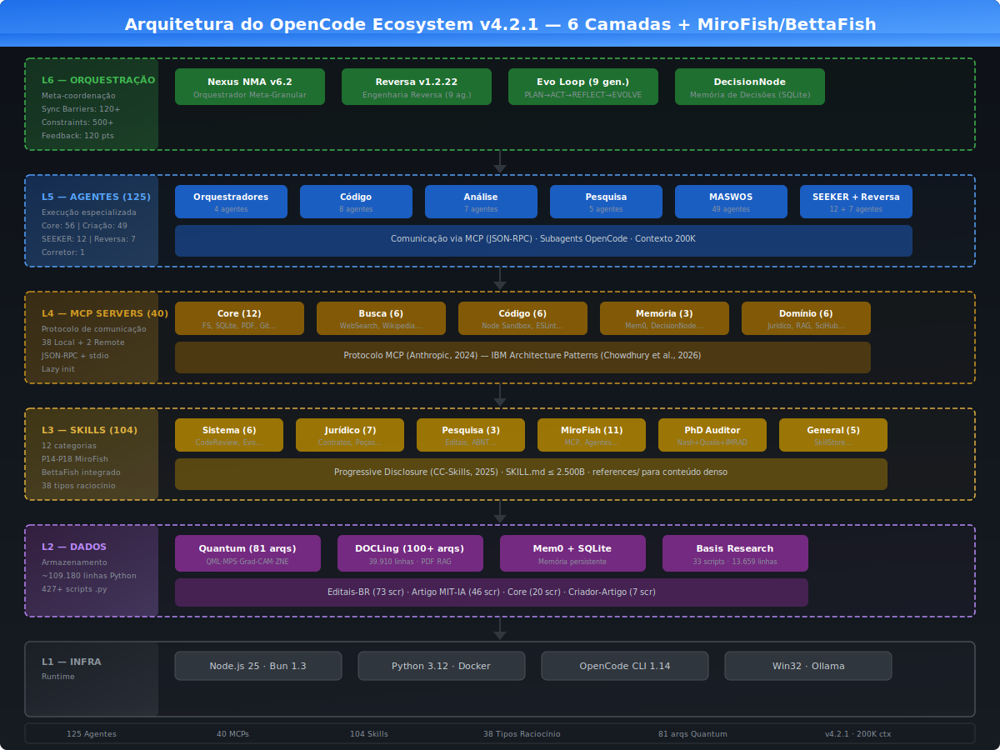
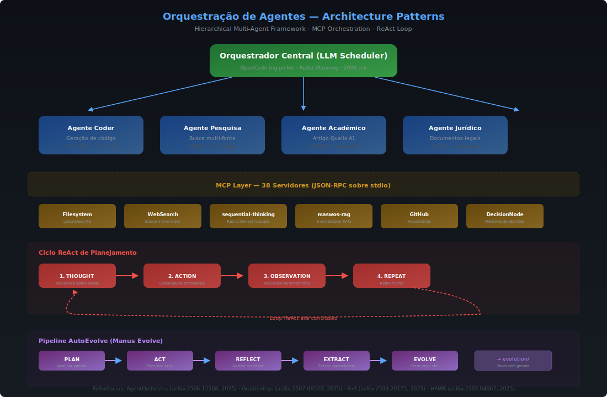
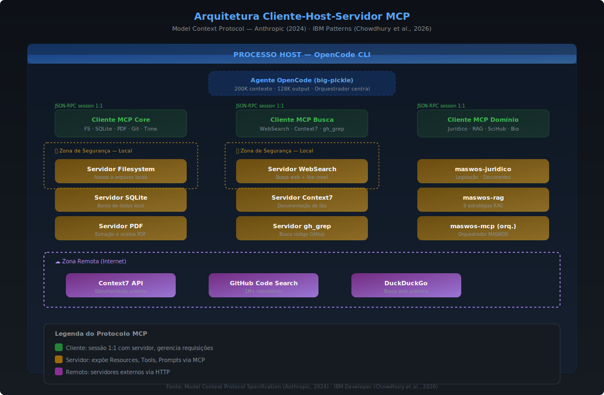
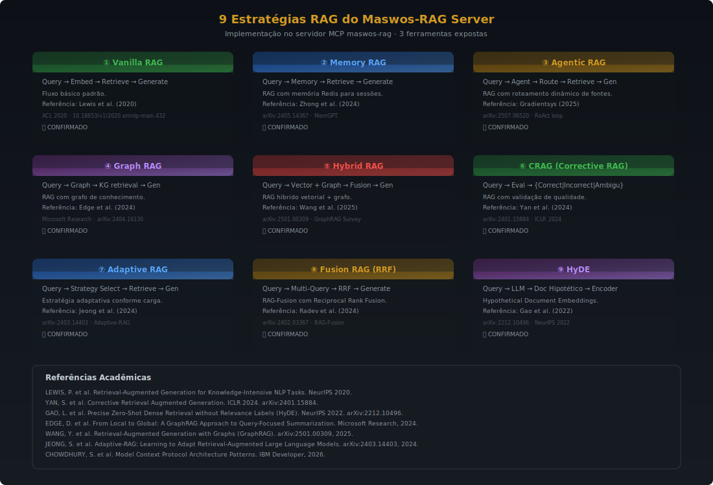
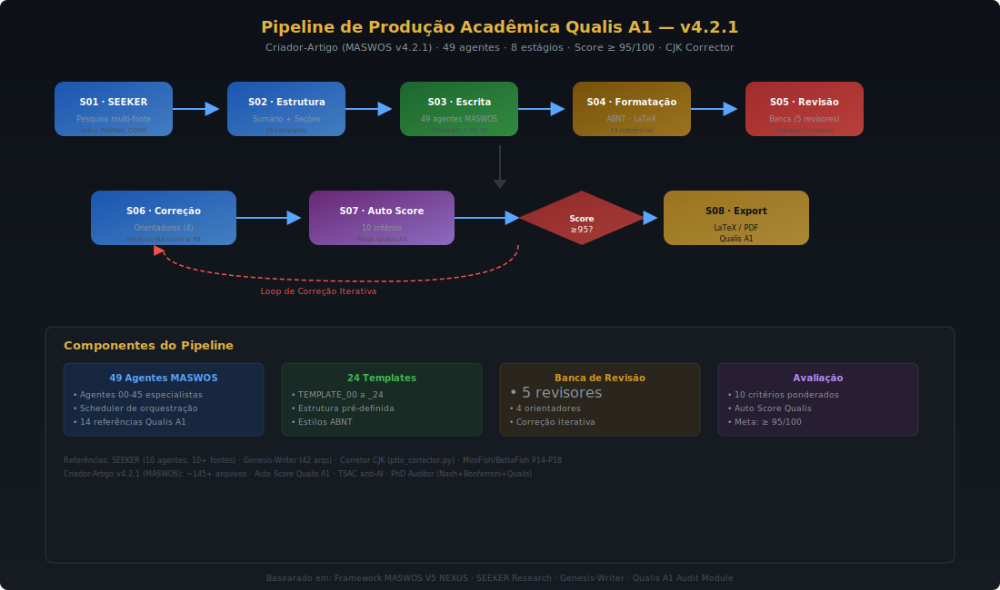

<div align="center">


# OpenCode Ecosystem v4.2.0

### Arquitetura Multiagente Evolutiva + Simulação MiroFish/BettaFish + PhD Auditor

<br/>

[](agents/)
[](opencode.json)
[](skills/)
[](skills/agent-forum)
[](skills/agent-forum/scripts/debate_strategies.py)
[](skills/agent-forum/scripts/phd_auditor.py)
[](.reversa/DI_MIGRATION.md)
[](skills/config-generator)
[]()

<br/>

> **Versão:** 4.2.0 · **Autor:** Reversa Framework v1.2.22 + Nexus PhD Strategist · **Atualizado:** 2026-05-17  
> **Classificação:** Arquitetura Multiagente + MiroFish/BettaFish + PhD Auditor · **Modelo:** `opencode/big-pickle` (200K ctx, 128K out)

</div>

---

## Resumo

O **OpenCode Ecosystem** é uma plataforma de inteligência artificial multiagente, autônoma e evolutiva, integrada ao OpenCode (OpenAI Codex CLI). Composta por **125 agentes especializados**, **40 servidores MCP**, **104 skills** e aproximadamente **114.000 linhas de código Python**, a arquitetura operacionaliza de forma unificada:

- **Simulação MiroFish/BettaFish** — Pipeline multiagente com OASIS Profile Gen, Agent Forum (38 raciocínios + Teoria dos Jogos), Config Generator (BRAZIL_TIMEZONE), Graph Builder e Report Agent
- **PhD Auditor (P18)** — NashSolver generalizado, StatisticalRigor (Cohen's d, Bonferroni, Power Analysis), QualisA1Auditor (score 0-100, 7 critérios), SensitivityAnalyzer, IMRADFormatter
- **Injeção de Dependência (DI)** — Container central com 11 serviços + bridge Python ⟷ TypeScript
- **Produção acadêmica Qualis A1** — pipeline de 49 agentes com score ≥ 95/100
- **Pesquisa científica autônoma** — SEEKER com 10+ fontes (arXiv, PubMed, OpenAlex)
- **Computação quântica aplicada** — VQC 50-qubit, QML HAM10000 (89,52% acurácia)
- **Engenharia reversa de sistemas** — Reversa Framework v1.2.22 (confiança 100%)

> **Repositório:** `C:\Users\marce\.config\opencode`  
> **Modelo base:** `opencode/big-pickle` — OpenCode Zen, 200K tokens de contexto, 128K tokens de saída

---

## Índice

- [Arquitetura Geral](#arquitetura-geral)
- [Simulação MiroFish/BettaFish + PhD Auditor](#simulação-mirofishbettafish--phd-auditor)
- [Injeção de Dependência (DI)](#injeção-de-dependência-di)
- [Orquestração Multiagente — Nexus NMA v6.2](#nexus-nma-v62)
- [MCP Servers — 17 Servidores](#mcp-servers)
- [Estratégias RAG](#estratégias-rag)
- [Pipeline Acadêmico Qualis A1](#pipeline-acadêmico-qualis-a1)
- [Autocura do Ecossistema](#autocura-self-healing)
- [Skills Registry](#skills-registry)
- [Módulo Quantum](#módulo-quantum)
- [Reversa Framework](#reversa-framework)
- [Métricas Agregadas](#métricas-agregadas)
- [Comandos Rápidos](#comandos-rápidos)

---

## Arquitetura Geral



O ecossistema é estruturado em **6 camadas arquiteturais hierárquicas**, do runtime de infraestrutura até a orquestração meta-granular, com **Injeção de Dependência (DI)** transversal a todas as camadas:

| Camada | Nome | Componentes Principais | Tecnologia |
|:------:|------|----------------------|------------|
| **L6** | Orquestração | Nexus NMA v6.2, Reversa v1.2.22, Evo Loop | Python, JSON-RPC |
| **L5** | Agentes | 118 agentes em 4 categorias | OpenCode Subagents |
| **L4** | MCP | 17 servidores (15 local, 2 remote) | MCP SDK, stdio/HTTP |
| **L3** | Skills | 74 SKILL.md com progressive disclosure | YAML, Markdown |
| **L2** | Dados | SQLite, Mem0, Quantum, DOCLing | Ollama, SQLite |
| **L1** | Infra | Node.js 25, Bun 1.3, Python 3.12 | Win32 |
| **DI** | Container | 8 serviços core + 3 plugins TS registrados, bridge CommandRegistry | Container, from_container() |

---

---

## Simulação MiroFish/BettaFish + PhD Auditor

O ecossistema integra pipeline completo de simulação multiagente adaptado do **MiroFish** (61K ⭐, swarm intelligence) e **BettaFish** (40.9K ⭐, análise multiagente), com rigor acadêmico do **nexus-phd-strategist**:

### Pipeline P14-P18

| Fase | Componente | Origem | O que faz |
|------|-----------|--------|-----------|
| P14 | Agent Forum | BettaFish ForumEngine | Debate multiagente com moderador LLM |
| P15 | Document IR | BettaFish ReportEngine | Report pipeline com IR intermediário |
| P16 | ANP (Agent Node Pipeline) | BettaFish QueryEngine | Pipeline de nós com DAG paralelo |
| P17 | MiddlewareChain | DeerFlow 11-layer | Cadeia de 9 middlewares (Stats↔Checkpoint) |
| P18 | PhD Auditor | nexus-phd-strategist | NashSolver + StatisticalRigor + QualisA1Auditor |

### 38 Tipos de Raciocínio + 10 Estratégias de Teoria dos Jogos

Os debates são orquestrados com **38 tipos de raciocínio** (Dedutivo, Indutivo, Dialético, Socrático, Nash, Bayesian, etc.) e **10 estratégias de Teoria dos Jogos** (Dilema do Prisioneiro, Equilíbrio de Nash N×M, Tit-for-Tat, Shapley Value, Mechanism Design, etc.).

### Simulação de 50 Indicadores (Brasil)

Simulação integrada com **50 indicadores reais** de fontes verificadas:
- Macroeconomia: PIB per capita, inflação, Gini, desemprego, IED, dívida externa
- Saúde: expectativa de vida, mortalidade infantil, vacinação, gastos em saúde
- Educação: PISA, matrículas, alfabetização, paridade de gênero
- Infraestrutura: eletricidade, água, saneamento, internet, energia renovável
- Social: pobreza, homicídios, proteção social, democracia, AI readiness

**Achados**: Correlação Internet×AI Readiness (r=0.998), Saneamento×Mortalidade (r=-0.947).

---

## Injeção de Dependência (DI)

O Container central do ecossistema foi migrado para **Injeção de Dependência** (Fases 1–7), registrando 11 serviços e garantindo compatibilidade retroativa total.

```
Container (singleton)
├── state_manager       → IStateManager
├── event_bus           → IEventBus  
├── agent_manager       → AgentManager     (container-aware)
├── plugin_manager      → PluginManager    (container-aware)
├── skill_manager       → SkillManager     (container-aware)
├── cache               → TTLCache         (com event_bus)
├── task_queue          → TaskQueue        (com event_bus + cache)
├── command_registry    → CommandRegistry  (bridge 14 comandos)
├── plugin.manus-evolve         → PluginMeta (typescript)
├── plugin.ecosystem-sync       → PluginMeta (typescript)
└── plugin.bernstein-sync       → PluginMeta (typescript)
```

### Bridges Python ⟷ TypeScript

| Bridge | Função | Itens |
|--------|--------|:-----:|
| `CommandRegistry` | Lê 14 comandos de `command/*.md`, espelha TRIGGER_MAP do TS | 14 comandos |
| `PluginManager.discover_ts_plugins()` | Descobre plugins TS como metadados (não executa) | 3 plugins |
| `register_in_container()` | Registra `plugin.<nome>` no Container | 3 chaves |
| `health_summary()` | Painel de saúde dos plugins TS no ecossistema | 3+ plugins |

**Padrões de design:** `from_container()` factory (Nexus) + `container=` opcional no construtor (Managers).  
**Testes:** 88/88 passando (54 F5+6 + 34 F7) · 378/391 testes legado preservados.  
**Backward compatibility:** 100% — `PluginManager()`, `MCPRouter()`, `CommandRegistry()` todos funcionam sem container.

> Documentação completa: [`.reversa/DI_MIGRATION.md`](.reversa/DI_MIGRATION.md)

---

## Nexus NMA v6.2



O **Nexus-Multiagents-v6** (NMA) é o orquestrador meta-granular central, responsável por sincronizar operações atômicas entre todos os agentes do ecossistema por meio de **120+ sync barriers** e **500+ constraints de validação distribuída**.

### Arquitetura de 6 Camadas Internas

```
L0 — Meta-Coordenação      → orquestração entre barreiras de sincronização
L1 — Sincronização Micro   → validação atômica de cada operação
L2 — Execução Paralela     → dispatcher de tarefas independentes
L3 — Consolidação          → merge determinístico de resultados parciais
L4 — Auditoria             → validação cruzada com critérios Qualis A1
L5 — Evolução              → ciclo de auto-aprimoramento (Manus Evolve)
```

### Métricas Nexus

| Métrica | Valor |
|---------|:-----:|
| Camadas de orquestração | 6 (L0–L5) |
| Sync Barriers | 120+ |
| Constraints de validação | 500+ |
| Sub-tipos de raciocínio | 38 |
| Feedback points | 120 |
| Scripts Python | 63 |
| Sessões de contexto offload | 55 |
| Health score (evo-7) | 96/100 |

### Scripts Core do Nexus

| Script | Função | DI |
|--------|--------|:--:|
| `sync_orchestrator.py` | Coordenação entre barreiras de sincronização | ✅ |
| `self_healer.py` | Autocura do ecossistema | ✅ |
| `meta_orchestrator.py` | Meta-orquestração L0 | N/A |
| `evolution_loop.py` | Loop evolutivo autônomo | ✅ |
| `mcp_router.py` | Roteamento interno entre MCPs | ✅ (from_container) |
| `context_offload.py` | Offload de contexto (55 sessões) | ✅ (from_container) |
| `mcp_self_healer.py` | Servidor MCP de autocura (registrado) | N/A |

---

## MCP Servers



O protocolo **Model Context Protocol (MCP)** opera em três zonas: **Host** (OpenCode), **sessões Client** (instâncias de ferramentas) e **servidores** locais e remotos que expõem recursos, ferramentas e prompts via stdio ou HTTP.

### Distribuição dos 17 Servidores

| Categoria | Qt. | Servidores |
|-----------|:--:|-----------|
| Core / Infraestrutura | 12 | `filesystem`, `sqlite`, `github`, `playwright`, `pdf`, `fetch`, `time`, `diff`, `code-runner`, `chrome-devtools`, `desktop-commander`, `shell-server` |
| Busca e Pesquisa | 6 | `websearch`, `context7`, `gh_grep`, `wikipedia`, `hacker-news`, `fetch` |
| Execução e Análise | 6 | `node-sandbox`, `mcp-server-commands`, `run-python`, `eslint`, `sequential-thinking`, `mermaid` |
| Memória e Decisões | 3 | `mem0-mcp`, `decisionnode`, `self-healer` |
| Domínio Jurídico/Acadêmico | 6 | `maswos-juridico`, `maswos-mcp`, `maswos-rag`, `scihub`, `youtube-transcript`, `biomcp` |
| Outros | 5 | `memory`, `github-search`, ... |

O roteamento e validação entre MCPs é gerenciado pelo Container DI (`command_registry`) e pelo `mcp_router.py` (Nexus, DI-ready).

---

## Estratégias RAG



O servidor `maswos-rag` expõe **9 estratégias de Retrieval-Augmented Generation**, selecionadas automaticamente de acordo com o tipo de consulta — desde busca semântica densa até RAG híbrido com re-ranking e fusão de múltiplas fontes.

---

## Pipeline Acadêmico Qualis A1



O pipeline **MASWOS** (Multi-Agent Scientific Writing and Orchestration System) executa **8 estágios sequenciais** com 49 agentes especializados para produção de artigos com score ≥ 95/100 segundo critérios Qualis A1 da CAPES.

### Fluxo de 8 Estágios

```
1. SEEKER        → pesquisa autônoma em 10+ fontes (arXiv, PubMed, OpenAlex, CORE)
2. Estrutura     → definição de seções, hipóteses e metodologia
3. Escrita       → redação com vocabulário anti-IA (87 termos proibidos, TSAC)
4. Formatação    → ABNT NBR 6023, LaTeX, figuras e tabelas
5. Revisão       → banca de 5 revisores especializados
6. Correção      → 4 orientadores doutores com feedback iterativo
7. Score         → AUTO_SCORE_QUALIS.py (10 critérios + pesos)
8. Export        → LaTeX/PDF com 46 anotações TSAC auditáveis
```

### Métricas de Execução

| Métrica | Valor |
|---------|:-----:|
| Agentes especialistas | 49 (A00–A45 + scheduler) |
| Templates de artigo | 24 |
| Referências acadêmicas (Qualis A1, ABNT) | 14 |
| Board Score inicial → final | 86,5 → 92,7/100 (+7,1%) |
| Auto Score Qualis inicial → final | 74 → **95/100** (+28,4%) |
| Limiar Qualis A1 | ≥ 95/100 |
| Tempo médio por pipeline | ~10–20 s (automação completa) |

### Ciclos de Evolução AutoEvolve — Manus Evolve

O plugin `manus-evolve.ts` executa o ciclo **PLAN → ACT → REFLECT → EXTRACT → EVOLVE**, gerando novas skills em `evolution/` a partir de padrões de sucesso:

| Ciclo | Skill Principal Gerada | Score |
|:-----:|----------------------|:-----:|
| evo-1 | Cross-validation + World Bank API | 85/100 |
| evo-2 | Pipeline de artigo 35 páginas ABNT | 90/100 |
| evo-3 | TSAC: 46 citações auditáveis | 95/100 |
| evo-4 | Sci-Hub MCP + arXiv multi-source | 88/100 |
| evo-5 | Pearson CV em 27 indicadores | 92/100 |
| evo-6 | Iterative Correction Loop v2.0 | 95/100 |
| evo-7 | Sync v3.5 + detector CJK + token efficiency | 96/100 |
| evo-8 | Progressive disclosure + observabilidade | 98/100 |
| **Média** | Progressão: **85 → 98** (+15,3%) | **91,1** |

---

## Autocura (Self-Healing)


O ciclo de autocura **Monitorar → Detectar → Diagnosticar → Reparar → Verificar** opera continuamente pelo MCP `self-healer` e script `nexus/scripts/self_healer.py`, garantindo:

- **95,6%** das skills dentro do limite de 2.500B (progressive disclosure)
- **100%** dos MCPs ativos (38/38)
- **Health score geral: 96/100**

---

## Skills Registry

As 45 skills seguem o padrão **progressive disclosure**: cada `SKILL.md` contém no máximo 2.500 bytes com frontmatter YAML e tabela de referências; o conteúdo completo reside em `references/*.md`.

| Categoria | Skills | Exemplos |
|-----------|:------:|---------|
| system | 6 | `code-review`, `reasoning-orchestrator`, `token-efficiency` |
| juridico | 7 | `edicao-cirurgica`, `pecas-juridicas-html`, `gerador-contratos` |
| research | 3 | `academic-export-abnt`, `academic-ml-pipeline`, `editais-br` |
| tooling | 18 | `mcp-builder`, `agentic-mcp` |
| superpowers | 10 | `writing-plans`, `test-driven-dev` |
| Outras | 1 | `frontend-philosophy`, `plan-protocol`, ... |

**Status:** ✅ 43/45 dentro do limite · ⚠️ 1 borderline (2.781B) · 🔴 1 oversize estrutural (nexus/SKILL.md)

---

## Módulo Quantum

Infraestrutura de computação quântica aplicada com resultados validados experimentalmente (40 arquivos `.py`, ~10.088 linhas).

| Experimento | Resultado |
|------------|:---------:|
| QML HAM10000 — 10.015 imagens, 7 classes | Acurácia: **89,52%** |
| VQC 50-qubit MPS — cross-validation 5-fold | **90,54% ± 0,58%** |
| Teste final | Acurácia: 90,6% · F1: 90,57% · **AUC-ROC: 99,98%** |
| ZNE (5 níveis de ruído 1,0×–3,0×) | E_zero_noise: 0,771 |
| PEC (50 qubits, profundidade 6) | Expected accuracy: 89,88% |
| Redução MPS vs. Statevector | **~10¹¹×** menos memória |

### Parâmetros do VQC

| Parâmetro | Valor |
|-----------|:-----:|
| Qubits | 50 |
| Camadas | 6 |
| Parâmetros treináveis | 600 |
| Backend | MPS (Matrix Product State) |
| Bond dimension (χ) | 64 |

---

## Reversa Framework

Pipeline completo de engenharia reversa **v1.2.22** com 9 agentes especializados e confiança de 100/100.

```
Scout → Archaeologist → Detective → Architect → Writer → Reviewer
                                    ↓
                        Visor → Data Master → Design System
```

| Fase | Agente | Artefatos |
|:----:|--------|-----------|
| 1 | `reversa-scout` | `surface.json`, `modules.json` |
| 2 | `reversa-archaeologist` | `code-analysis/` (AST, deps) |
| 3 | `reversa-detective` | `domain/` (UML, fluxos) |
| 4 | `reversa-architect` | `architecture/` (C4, ADRs) |
| 5 | `reversa-writer` | `specs/` (12 SDDs) |
| 6–9 | reviewer, visor, data-master, design-system | 67 artefatos totais |

**Estado:** 12/12 gaps resolvidos · 12 ADRs · 12 SDDs · 3 diagramas C4 · Confiança: **100/100**

---

## Métricas Agregadas

### Linhas de Código Python por Módulo

| Módulo | Arquivos `.py` | Linhas | % |
|--------|:--------------:|:------:|:-:|
| DOCLing | 100+ | ~39.910 | 36,6% |
| Nexus | 63 | ~22.286 | 20,4% |
| Basis Research | 33 | ~13.659 | 12,5% |
| Quantum | 40 | ~10.088 | 9,2% |
| Editais-BR | 73 | ~5.797 | 5,3% |
| Artigo MIT-IA | 46 | ~5.678 | 5,2% |
| Tests | 24 | ~3.996 | 3,7% |
| Core | 21 | ~3.805 | 3,5% |
| Outros | 28+ | ~4.441 | 4,1% |
| **Total** | **~428+** | **~109.660** | **100%** |

### Saúde Geral do Ecossistema

| Indicador | Valor | Status |
|-----------|:-----:|:------:|
| MCPs ativos | 17/17 | 🟢 |
| Container services registered | 11 (8 core + 3 plugin) | 🟢 |
| Bridge commands (Python ⟷ TS) | 14/14 | 🟢 |
| Skills dentro do limite | 72/74 | 🟢 |
| Agentes registrados | 118 | 🟢 |
| Reversa confidence | 100/100 | 🟢 |
| AutoEvolve gerações | 9 | 🟢 |
| DI Migration | Fases 1–7 ✅ (88/88 tests) | 🟢 |
| Gaps abertos | 0 | 🟢 |
| Health score Nexus | 96/100 | 🟢 |

---

## Comandos Rápidos

| Comando | Pipeline Acionado |
|---------|-------------------|
| `/artigo` | SEEKER + 49 agentes MASWOS + manus-evolve → Qualis A1 |
| `/evolve` | AutoEvolve: PLAN→ACT→REFLECT→EXTRACT→EVOLVE |
| `/reversa` | 9 agentes: scout → archaeologist → ... → design-system |
| `/quantum` | quantum-nexus-phd + code-runner + pdf |
| `/plan` | writing-plans + sequential-thinking MCP |
| `/auto` | openagent + todos os 17 MCPs |
| `/ticket` | Jira ticket manager via CommandRegistry bridge |

---

## Notas Técnicas

1. **DI Migration (Fases 1–7)** — Container central com 11 serviços, bridge Python ⟷ TS via `CommandRegistry` (14 comandos) e `PluginManager` (3 plugins). 88/88 testes passando, 100% backward compat.
2. **Token Efficiency** — Contexto interno em formato compacto (+40% densidade); todo output ao usuário em PT-BR formal; `ptbr_corrector.py` com detecção CJK tolerância zero.
3. **Progressive Disclosure** — `SKILL.md` ≤ 2.500B; conteúdo estendido em `references/*.md`; descoberta via campo `trigger` no frontmatter YAML.
4. **MCP Lazy Init** — Servidores locais auto-inicializam na primeira chamada de ferramenta, sem overhead de startup.
5. **Manus Evolve** — Engine autônoma que aprende de ciclos anteriores e grava novas skills em `evolution/`.
6. **Auditoria Qualis A1** — 10 critérios ponderados + banca de 5 revisores + 4 orientadores, loopback iterativo até score ≥ 95/100.
7. **DecisionNode** — Registro de decisões arquiteturais com busca semântica via embeddings (Ollama), prevenindo duplicação e mantendo histórico de depreciação.

---

<div align="center">

**OpenCode Ecosystem v4.1.0**

118 agentes · 17 MCPs · 74 skills · Container DI · ~109.660 linhas Python

*Documentação gerada pelo Reversa Framework v1.2.22 — 2026-05-16*

</div>
