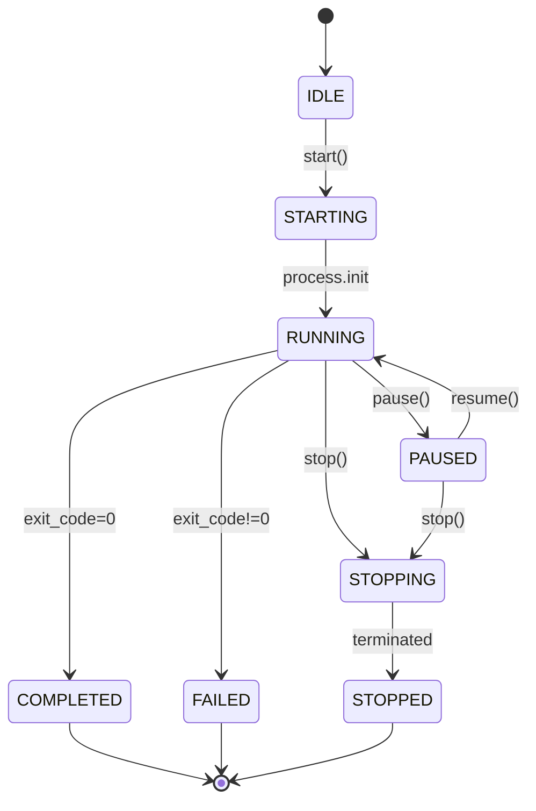
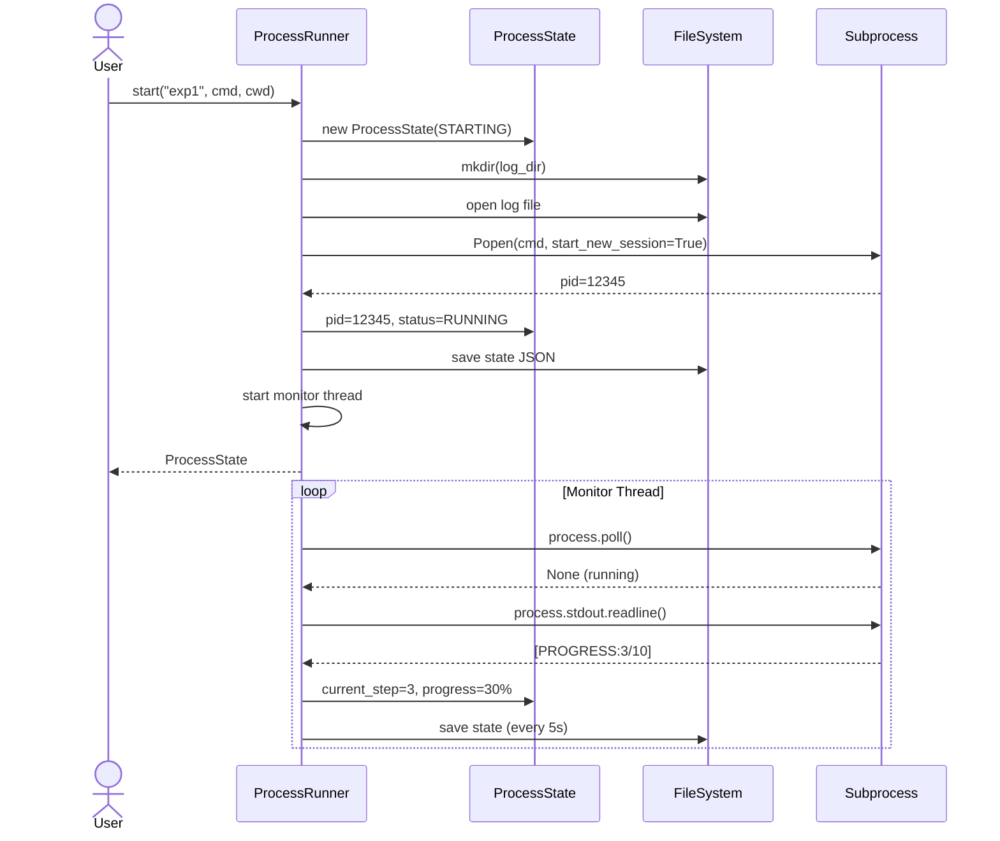

# Process Lifecycle — Pseudocódigo do Fluxo

## Ciclo de Vida

```
                ┌──────────────────────────────────────────────┐
                │                                              │
                ▼                                              │
IDLE → STARTING → RUNNING → COMPLETED                         │
                   │                                           │
                   ├── → RUNNING → PAUSED → RUNNING            │
                   │                                           │
                   ├── → RUNNING → STOPPING → STOPPED          │
                   │                                           │
                   └── → RUNNING → FAILED                      │
                                                                │
                COMPLETED, FAILED, STOPPED → [*] (fim)          │
┌──────────────────────────────────────────────────────────────┘
```

## Fluxo de Inicialização

```
START(process_id, cmd, cwd):
  1. Adquirir lock
  2. Verificar se process_id já existe → erro se sim
  3. Criar ProcessState(status=STARTING, timestamp=now)
  4. Adicionar _states[process_id] = state
  5. Liberar lock
  6. Criar diretório de logs se necessário
  7. Configurar env (PYTHONUTF8=1, PYTHONIOENCODING=utf-8, +user env)
  8. Abrir arquivo de log (append mode)
  9. Iniciar subprocess.Popen:
       cmd = cmd
       stdout = subprocess.PIPE
       stderr = subprocess.STDOUT
       stdin = subprocess.PIPE
       cwd = cwd (ou os.getcwd())
       env = proc_env
       encoding = "utf-8"
       errors = "replace"
       start_new_session = True
       bufsize = 1 (line-buffered)
 10. Fechar e reabrir arquivo de log (garantir flush)
 11. Salvar PID em ProcessState.pid
 12. Definir status = RUNNING
 13. Persistir estado em JSON (_save_state)
 14. Criar threading.Thread(target=_monitor, args=(process_id, log_file))
     → thread daemon, name=f"mon-{process_id}"
 15. Iniciar thread
 16. Retornar ProcessState

Erros:
  - OSError: status = FAILED, error = str(e), salvar estado
```

## Fluxo de Monitoramento

```
MONITOR(process_id, log_file):
  ┌─ process = _processes[process_id]
  ├─ state = _states[process_id]
  ├─ stop_event = _stop_events[process_id]
  ├─ last_save = time.now()
  └─ poll_interval = 2.0

  LOOP:
    ├─ SE stop_event.is_set() → BREAK
    │
    ├─ exit_code = process.poll()
    │  ├─ exit_code IS NOT None:
    │  │  ├─ exit_code == 0 → status = COMPLETED
    │  │  ├─ exit_code != 0 → status = FAILED, ler tail(log, 2000 chars)
    │  │  ├─ completed_at = now
    │  │  ├─ progress = 100% se completed
    │  │  ├─ Ler resto do stdout, escrever no log
    │  │  ├─ Salvar estado
    │  │  └─ BREAK
    │  │
    │  └─ exit_code IS None (ainda rodando):
    │     ├─ SE status == PAUSED → sleep(2), CONTINUE
    │     ├─ line = process.stdout.readline()
    │     ├─ SE line:
    │     │  ├─ Escrever no log
    │     │  ├─ [PROGRESS:X/Y] → extrair X,Y, atualizar step/total
    │     │  ├─ JSON parse:
    │     │  │  ├─ event_type == "simulation_end" → sub_status[platform]=true
    │     │  │  └─ event_type == "round_end" → current_step = round
    │     │  └─ Recalcular progress_percent
    │     │
    │     └─ Agora - last_save >= 5s → _save_state, reset last_save
    │
    └─ sleep(0.1)

  FINALLY:
    ├─ Salvar estado final
    ├─ Fechar log_file
    ├─ Remover de _states, _processes, _monitor_threads, _stop_events
    └─ Fim da thread
```

## Fluxo de Parada

```
STOP(process_id, timeout=10):
  1. state = get_state(process_id)
  2. status = STOPPING, salvar estado
  3. process = _processes[process_id]

  4. SE process existe:
     ├─ Windows:
     │  ├─ taskkill /T /PID {pid} (timeout: timeout)
     │  └─ TimeoutExpired → taskkill /F /T /PID {pid} (timeout: 5)
     │
     ├─ Unix:
     │  ├─ pgid = os.getpgid(pid)
     │  ├─ os.killpg(pgid, SIGTERM)
     │  ├─ process.wait(timeout)
     │  └─ TimeoutExpired → os.killpg(pgid, SIGKILL)
     │
     └─ Fallback (genérico):
        ├─ process.terminate()
        ├─ process.wait(timeout)
        └─ TimeoutExpired → process.kill(), wait(5)

  5. stop_event.set()
  6. process.wait(5) (ou process.kill() + wait)
  7. status = STOPPED, completed_at = now
  8. Salvar estado
  9. Remover de dicts internos
 10. Retornar estado
```

## Fluxo de Parsing de Logs

```
PARSE_ACTION_LOG(process_id, limit=50):
  1. state = get_state(process_id)
  2. SE state.log_path não existe → retornar []

  3. Open file, iterate lines:
     ├─ line.strip() vazio → CONTINUE
     ├─ json.loads(line):
     │  ├─ SE "action_type" in data OU event_type == "agent_action":
     │  │  ├─ actions.append({
     │  │  │    agent_id, action_type, args,
     │  │  │    confidence (default 0.7),
     │  │  │    timestamp
     │  │  │  })
     │  │  └─ SE len(actions) >= limit → BREAK
     │  └─ json.JSONDecodeError → CONTINUE
     └─ OSError → retornar actions[]

  4. Retornar actions
```

## Diagrama de Estados (Mermaid)



## Diagrama de Sequência (Inicialização)



## Estrutura de Dados: ProcessState (JSON)

```json
{
  "process_id": "simulacao-01",
  "status": "running",
  "pid": 12345,
  "started_at": "2026-05-17T10:30:00",
  "completed_at": null,
  "current_step": 3,
  "total_steps": 50,
  "progress_percent": 6.0,
  "error": null,
  "log_path": ".process-logs/simulacao-01/simulacao-01.log",
  "sub_status": {
    "twitter": false,
    "reddit": true
  }
}
```

## Ações Extraídas do Log

Cada linha JSON no log pode representar uma ação de agente:

```json
{
  "agent_id": "agent-01",
  "action_type": "CREATE_POST",
  "args": {"content": "Hello world", "platform": "twitter"},
  "confidence": 1.0,
  "timestamp": "2026-05-17T10:30:05"
}
```

Ou um evento de simulação:

```json
{
  "event_type": "simulation_end",
  "platform": "twitter",
  "timestamp": "2026-05-17T10:35:00"
}
```

Ou progresso:

```
[PROGRESS:7/50]
```
